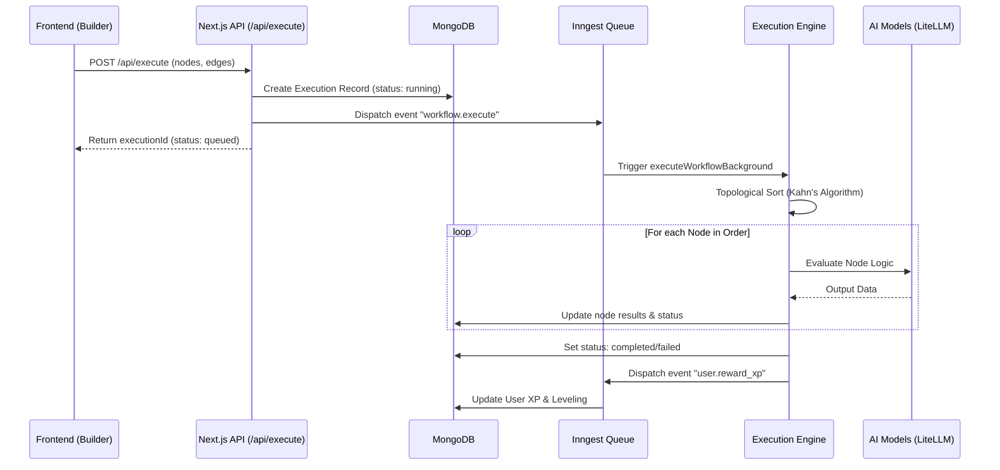

# BuildRAX.ai: Backend Architecture Documentation

This document provides a comprehensive overview of the BuildRAX.ai backend architecture, its interaction with frontend components, the workflow execution engine, and the systems governing AI generation and gamification.

---

## 1. High-Level Overview
BuildRAX.ai is an AI-native automation platform designed for scalability, reliability, and high performance. The backend follows an **Event-Driven Architecture (EDA)**, leveraging asynchronous processing to handle complex, multi-step AI workflows without blocking the user interface.

### Key Goals:
- **Scalability:** Handles multiple concurrent workflow executions using distributed queues.
- **Reliability:** Persistent execution state in MongoDB with automatic retries via Inngest.
- **AI-Native:** Deep integration with multiple LLM providers via LiteLLM.
- **Gamification:** Integrated XP and leveling system to drive user engagement.

---

## 2. Tech Stack & Infrastructure
- **Framework:** [Next.js 15 (App Router)](https://nextjs.org/)
- **Database:** [MongoDB](https://www.mongodb.com/) (ODM: Mongoose)
- **Background Jobs:** [Inngest](https://www.inngest.com/) (Event-driven serverless functions)
- **AI Integration:** [LiteLLM](https://github.com/BerriAI/litellm) (Universal API for 100+ LLMs)
- **State Management:** React Context + ReactFlow (Frontend), MongoDB (Backend)
- **Deployment:** Vercel / Docker-ready

---

## 3. System Architecture
The following diagram illustrates the lifecycle of a workflow execution, from the initial user request to the final result and reward.

---

## 4. Workflow Execution Engine
At the heart of BuildRAX.ai is a custom-built execution engine designed to process Directed Acyclic Graphs (DAGs).

### 4.1 Topological Sorting
The engine uses **Kahn's Algorithm** to determine the correct execution order of nodes. This ensures that every node only runs after its dependencies (upstream nodes) have successfully completed.
- **Cycle Detection:** If a circular dependency is detected, the execution is immediately aborted with a "Cycle Detected" error.

### 4.2 Node Evaluation (`evaluateNodeLogic`)
Each node type (LLM, Search, Scraper, etc.) has its own specialized logic defined in `src/lib/node-evaluator.ts`.
- **LLM Nodes:** Standardized prompts are sent via LiteLLM to providers like OpenAI, Anthropic, or Google.
- **Search Nodes:** Integrate with external APIs to fetch real-time web data.
- **Logic Nodes:** Process data (e.g., conditions, loops, combining strings).

### 4.3 Asynchronous Execution
By offloading execution to **Inngest**, the main API thread remains responsive. Inngest provides:
- **Durable Execution:** If a function fails due to an external API error, it can be retried automatically.
- **Step-by-Step Logging:** Every node's input, output, and execution time are captured and stored in MongoDB.

---

## 5. AI Architect & Governance
The **AI Architect** is a suite of tools designed to help users design and optimize their workflows.

| Endpoint | Purpose |
| :--- | :--- |
| `/api/architect/generate` | Generates a full node/edge architecture from a natural language prompt. |
| `/api/architect/analyze` | Perfroms an "AI Audit" on a workflow, identifying edge cases and suggestions. |
| `/api/architect/optimize` | Analyzes prompts within the workflow to reduce token usage and cost. |

---

## 6. Frontend-Backend Interaction
The frontend interacts with the backend through several key patterns:

1.  **Immediate Feedback:** When a user clicks "Launch Agent", the API returns an `executionId` immediately.
2.  **State Synchronization:** The `ExecutionPanel` polls for updates or listens for state changes to display a real-time trace of the workflow's progress.
3.  **Persistence:** All changes on the canvas are autosaved to `/api/workflows/[id]`.

---

## 7. Gamification & Progression
BuildRAX.ai rewards users for actively building and running workflows.
- **Events:** Key actions (Successfully executing a workflow, publishing a template) trigger asynchronous `user.reward_xp` events.
- **Processing:** The gamification engine (`src/lib/gamification.ts`) calculates XP gains and updates the user's level and progress in MongoDB.

---

## 8. Troubleshooting & Common Failures

> [!IMPORTANT]
> Understanding execution failures is key to debugging complex workflows.

### 8.1 Cycle Detected
- **Cause:** The workflow contains a circular path (e.g., Node A -> Node B -> Node A).
- **Solution:** Redesign the graph to ensure it is a Directed Acyclic Graph (DAG).

### 8.2 Node Execution Timeout
- **Cause:** An external API (like an LLM or Web Scraper) took too long to respond.
- **Solution:** Check the `executionTimeMs` in the execution trace. Consider increasing timeouts or splitting complex tasks into smaller nodes.

### 8.3 Context Window Exceeded
- **Cause:** Upstream data passed to an LLM node exceeds the model's token limit.
- **Solution:** Use the **Token Optimizer** tool or add a "Summarizer" node to trim the context before it reaches the LLM.

### 8.4 Authentication Errors
- **Cause:** Invalid or expired API keys for external services (OpenAI, Slack, etc.).
- **Solution:** Verify credentials in the Node Configuration panel.

---

## 9. Developer Guidelines

### Adding a New Node Type
1.  **Define UI:** Add the node type to `src/components/nodes/` and register it in `nodeTypes`.
2.  **Define Logic:** Add the execution logic for the new node in `src/lib/node-evaluator.ts`.
3.  **Register Library:** Add the node metadata to the `NODE_LIBRARY` constant in the builder page.

### Modifying the Engine
The core execution logic resides in `src/lib/execution-engine.ts`. Any changes here will affect all workflow runs, so ensure rigorous testing with complex DAG structures.
