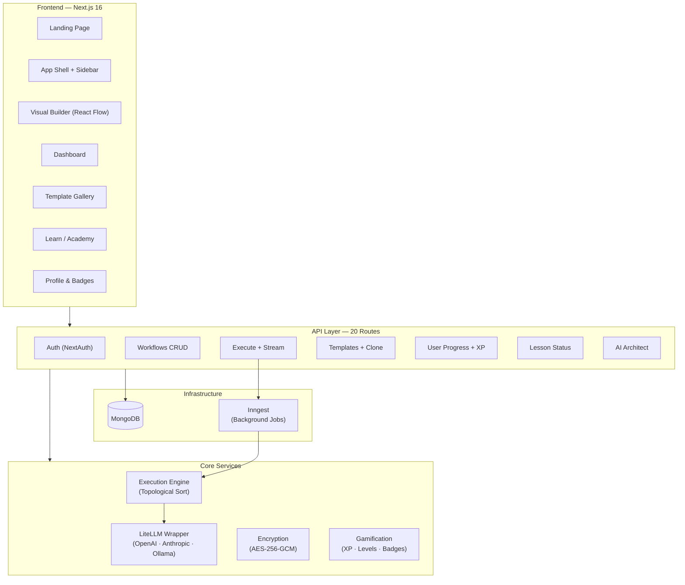

<](#)
[](#license)
[](https://nextjs.org/)
[](https://www.mongodb.com/)

[Quick Start](#-quick-start) · [Features](#-features) · [Architecture](#-architecture) · [Node Guide](#-node-guide) · [Self-Host](#-self-hosting) · [Contributing](#-contributing)

</div>

---

## 📖 What is BuildRAX?

BuildRAX is an **open-source visual AI workflow builder**. You drag blocks onto a canvas, connect them with wires, and click Run — then watch exactly how data flows through prompts, models, tools, and memory step by step.

It's built for **three kinds of people**:

- **Students & non-technical users** — Learn AI concepts hands-on through guided missions, no coding required. The built-in Academy walks you from "What is a Prompt?" to "Multi-Agent Workflows."

- **Developers** — Rapidly prototype LLM chains, RAG pipelines, and tool-using agents visually, then export or deploy them as APIs. Full backend with 20+ REST endpoints.

- **AI Practitioners & Educators** — See the exact prompt, context, and model output at every step. Use the gamified XP system to run workshops and courses.

---

## ⚡ Quick Start

```bash
git clone https://github.com/chetanya1998/BuildRAX.ai.git
cd BuildRAX.ai
npm install
```

Create `.env.local`:

```env
MONGODB_URI=mongodb+srv://<user>:<pass>@cluster.mongodb.net/buildrax
NEXTAUTH_SECRET=your-secret-here
NEXTAUTH_URL=http://localhost:3000
OPENAI_API_KEY=sk-...
```

Start the app:

```bash
npm run dev          # Frontend + API
npx inngest-cli@latest dev   # Background task runner (separate terminal)
```

Open **http://localhost:3000** → Sign in (or continue as Guest) → Start building.

---

## ✨ Features

### 🎨 Visual Workflow Builder

A drag-and-drop canvas built on **React Flow** with 14 node types. Connect inputs to prompts to models to outputs — all visually. Includes a node library sidebar, mini-map, and properties panel for editing node settings.

### 🔍 Execution Trace & Debugging

Click **Run Flow** and watch your workflow execute node-by-node in real time. The Execution Trace Panel shows four tabs:

- **Flow Steps** — Timeline of every node with execution timing.
- **Prompt** — The exact system prompt and user message sent to the LLM.
- **Context** — Retrieved documents and tool outputs used as context.
- **Output** — Final rendered response with generation metadata.

### 📄 Template Gallery

Five starter templates to learn from: Resume Analyzer, Research Synthesizer, Daily Planner, Content Generator, and Simple Research Agent. Browse by category (Writing, Research, Productivity, Agents), and **Clone to Builder** in one click.

### 🔐 Authentication

Sign in with **GitHub**, **Google**, or continue as a **Guest** — no account required to explore. User API keys are encrypted with **AES-256-GCM** before storage.

### 🎮 Gamification & Academy

Earn XP by building, executing, and sharing workflows. Level up from *Workflow Creator* to *AI Architect* and unlock badges like *First Build*, *Community Builder*, *Prompt Tuner*, and *Agent Explorer*. The Academy has 5 progressive missions from beginner to advanced.

### 📤 Publishing & Sharing

Publish your workflows to the community as public templates or share them via private link. Enable/disable remixing so others can clone and modify your logic.

### 📊 Dashboard & Profile

A personalized dashboard shows your level, XP progress, recent workflows, and suggested templates. The profile page tracks total XP, workflow count, templates cloned, and current streak.

---

## 🏗 Architecture

### System Diagram



### Tech Stack

| Layer | Technology | Notes |
|-------|-----------|-------|
| Framework | Next.js 16 (App Router) | Route Groups: `(marketing)` and `(app)` |
| UI Canvas | @xyflow/react 12 | Drag-and-drop workflow builder |
| Styling | Tailwind CSS v4 + shadcn/ui | Dark mode, glassmorphism |
| Animations | Framer Motion | Page transitions, micro-animations |
| Auth | NextAuth.js + JWT | GitHub, Google, Guest providers |
| Database | MongoDB + Mongoose | 5 models: User, Workflow, Execution, Template, LessonProgress |
| Tasks | Inngest | Event-driven background workflow execution |
| AI | LiteLLM (OpenAI SDK) | Unified wrapper for 100+ model providers |
| Encryption | Node.js crypto | AES-256-GCM for API key storage |

### How Execution Works

1. User clicks **Run Flow** → `POST /api/execute`
2. API creates an `Execution` record (`status: running`) and fires an Inngest event.
3. Inngest runs the `executeWorkflowBackground` function:
   - Builds the graph from nodes + edges.
   - **Topological sort** (Kahn's algorithm) determines execution order and detects cycles.
   - Processes each node in order, passing outputs to downstream inputs.
   - `inputNode` → returns raw value. `promptNode` → replaces `{{handle}}` variables. `llmNode` → calls LiteLLM. `outputNode` → passes through final result.
4. Each node's `output`, `executionTimeMs`, and `error` (if any) are recorded.
5. Execution record is updated to `completed` or `failed`.

---

## 🧩 Node Guide

BuildRAX ships with **14 node types** organized into four categories. Each node renders from a shared `BaseNode` component with color-coded headers, dynamic input/output handles, and a live "Simulated Output" preview during execution.

### Core Nodes

**🔵 Input** — The starting point. Type or paste your data (a question, a resume, a topic). Outputs the raw value to the next node.

**🟠 Prompt** — A template engine. Write a prompt with `{{handle}}` placeholders that get filled with data from upstream nodes. Example: `"Summarize the following: {{default}}"`.

**🟣 LLM** — The brain. Sends the assembled prompt to a language model and returns the response. Configurable model (GPT-4o, GPT-3.5, Llama 3), system prompt, and temperature (0–2).

**🟢 Output** — The endpoint. Receives the final result and displays it. This is the terminal node of any flow.

### Tool & Integration Nodes

**🔍 Search** — Runs a Google search query and returns structured results. Great for grounding LLM responses in real-time data.

**🌐 Scraper** — Fetches and extracts content from a URL. Feed web content into your AI pipeline.

**🔮 Memory (Vector DB)** — Performs similarity search against a vector database. Essential for building RAG (Retrieval-Augmented Generation) workflows.

### Communication Nodes

**💬 Slack** · **💬 Discord** · **🐦 Twitter** · **✉️ Email** — Send the output of your workflow to external platforms. Connect them at the end of any chain.

### Control Flow Nodes

**🟡 Condition** — An If/Else gate. Evaluates input and routes to a `true` or `false` output branch.

**🩷 Loop** — Iterates over an array, sending each item through downstream nodes one at a time.

**🩵 Combine** — Merges two data streams (`a` + `b`) into a single `merged` output.

---

## 🔧 Building a Flow — Step by Step

### 1. Open the Builder
Go to `/builder` from the sidebar. You'll see an empty canvas with default nodes.

### 2. Add Nodes
From the **Node Library** on the left, drag any node type onto the canvas.

### 3. Connect Nodes
Click the output handle (right side) of one node and drag to the input handle (left side) of another. An animated edge forms showing data direction.

### 4. Configure Properties
Click any node to select it. The **Properties Panel** on the right shows editable fields:

- **Input Node** — Text area for raw input data.
- **Prompt Node** — Template text area with `{{handle}}` variable support.
- **LLM Node** — Model dropdown, system prompt text area, and temperature slider (0–2).

### 5. Run & Inspect
Click **▶ Run Flow** in the toolbar. The Execution Trace Panel opens on the right, showing the step-by-step trace with timing data, the exact prompt sent, and the final output.

### 6. Publish
Click **Share** → set a title and description → choose Public or Private visibility → **Save & Publish**. Toggle remixing on/off.

---

## 🖥 Self-Hosting

### Prerequisites

- Node.js 18+ (recommended: 20 LTS)
- MongoDB 6+ (Atlas or local)
- npm or pnpm

### Environment Variables

```env
# Required
MONGODB_URI=mongodb+srv://...
NEXTAUTH_SECRET=<random-string>
NEXTAUTH_URL=http://localhost:3000
OPENAI_API_KEY=sk-...

# Optional: Route through LiteLLM proxy for 100+ models
LITELLM_BASE_URL=http://localhost:4000
LITELLM_API_KEY=sk-...

# Optional: OAuth (without these, only Guest login is available)
GITHUB_ID=...
GITHUB_SECRET=...
GOOGLE_ID=...
GOOGLE_SECRET=...

# Optional: API key encryption (defaults to a dev key)
ENCRYPTION_SECRET=<32-character-string>
```

### Running in Production

```bash
npm run build
npm start
```

### Using Local Models (Ollama)

Run AI workflows **entirely offline** — no cloud API keys needed:

```bash
# 1. Start Ollama
ollama serve && ollama pull llama3

# 2. Start LiteLLM proxy
pip install litellm[proxy]
litellm --model ollama/llama3 --port 4000

# 3. Set in .env.local
LITELLM_BASE_URL=http://localhost:4000
```

All LLM nodes will now route through your local Ollama instance.

### Customization Entry Points

| What | Where |
|------|-------|
| Add a new node type | `src/components/nodes/index.tsx` — create component + add to `nodeTypes` map |
| Add an API endpoint | `src/app/api/<name>/route.ts` |
| Change the theme | `src/app/globals.css` (CSS variables) |
| Add an auth provider | `src/lib/auth.ts` |
| Modify execution logic | `src/inngest/functions.ts` |

---

## 📡 API Reference

20 REST endpoints organized by domain:

<details>
<summary><strong>Authentication</strong></summary>

| Endpoint | Description |
|----------|-------------|
| `/api/auth/[...nextauth]` | NextAuth handler (login, callback, session) |

</details>

<details>
<summary><strong>Workflows</strong></summary>

| Endpoint | Description |
|----------|-------------|
| `GET/POST /api/workflows` | List all or create a workflow |
| `GET/PUT/DELETE /api/workflows/[id]` | CRUD for a specific workflow |
| `GET /api/workflows/recent` | Recently edited workflows |
| `POST /api/workflows/[id]/quick-run` | Quick inline execution |

</details>

<details>
<summary><strong>Execution</strong></summary>

| Endpoint | Description |
|----------|-------------|
| `POST /api/execute` | Start background execution via Inngest |
| `GET /api/execute/stream` | Stream execution results |

</details>

<details>
<summary><strong>Templates</strong></summary>

| Endpoint | Description |
|----------|-------------|
| `GET/POST /api/templates` | List or create templates |
| `GET /api/templates/featured` | Starter templates |
| `GET /api/templates/[id]` | Get a specific template |
| `POST /api/templates/[id]/clone` | Clone into workflows |

</details>

<details>
<summary><strong>User & Learning</strong></summary>

| Endpoint | Description |
|----------|-------------|
| `GET /api/user/progress` | XP, level, and progress |
| `POST /api/user/xp/gain` | Award XP |
| `GET /api/learn/status` | Lesson completion status |
| `POST /api/learn/complete` | Mark lesson completed |
| `POST /api/learn/complete-step` | Mark a step completed |

</details>

<details>
<summary><strong>Dashboard & AI Architect</strong></summary>

| Endpoint | Description |
|----------|-------------|
| `GET /api/dashboard/summary` | Aggregated dashboard data |
| `POST /api/architect/analyze` | AI-powered workflow analysis |
| `POST /api/architect/generate` | AI-powered workflow generation |

</details>

---

## 🗺 Roadmap

### ✅ Shipped

- Multi-model LLM support via LiteLLM (OpenAI, Anthropic, Ollama)
- Visual workflow builder with 14 node types
- Topological execution engine with cycle detection
- Background job execution via Inngest
- Template gallery with cloning
- Gamification system (XP, levels, badges)
- BuildRAX Academy with 5 interactive missions
- AI Architect endpoint for automated analysis/generation
- Encrypted API key storage
- Multi-provider authentication (GitHub, Google, Guest)

### 🏗 In Progress

- **Python Execution Nodes** — Run Python code blocks within the visual flow.
- **Multi-Agent Orchestration** — Agent-to-agent communication and supervisor-worker patterns.
- **Advanced RAG** — Built-in vector embedding and chunking management.
- **Agent-as-an-API** — One-click deployment of workflows as REST endpoints.

### 🔮 Future

- Real-time collaborative editing
- Git-like version control for workflows
- Community marketplace for templates and node packages
- Mobile companion app
- Enterprise features (team workspaces, audit logs, SSO)

---

## 🤝 Contributing

```bash
# Fork, clone, branch
git checkout -b feature/my-node

# Develop
npm run dev

# Push and open a PR
git push origin feature/my-node
```

**Ways to contribute:**
- 🧩 **New nodes** — Add components in `src/components/nodes/`
- 📄 **Templates** — Design useful starter workflows
- ⚡ **Engine** — Improve execution speed and reliability
- 📚 **Docs** — Expand this README or add tutorials
- 🎨 **UI/UX** — Improve design and accessibility

### Project Structure

```
src/
├── app/
│   ├── (marketing)/        # Landing page, login
│   ├── (app)/              # Dashboard, builder, templates, learn, profile
│   └── api/                # 20 REST API routes
├── components/
│   ├── nodes/              # 14 custom React Flow node types
│   ├── Sidebar.tsx         # App navigation
│   ├── ExecutionPanel.tsx  # Execution trace viewer
│   └── PublishModal.tsx    # Workflow sharing dialog
├── inngest/                # Background task definitions
└── lib/                    # Core services
    ├── auth.ts             # NextAuth config
    ├── encryption.ts       # AES-256-GCM
    ├── execution-engine.ts # Topological sort engine
    ├── gamification.ts     # XP and levels
    ├── litellm.ts          # AI model wrapper
    └── models/             # Mongoose schemas (User, Workflow, Execution, Template, LessonProgress)
```

---

## 📜 License

MIT License

Copyright (c) 2025 BuildRAX.ai

Permission is hereby granted, free of charge, to any person obtaining a copy
of this software and associated documentation files (the "Software"), to deal
in the Software without restriction, including without limitation the rights
to use, copy, modify, merge, publish, distribute, sublicense, and/or sell
copies of the Software, and to permit persons to whom the Software is
furnished to do so, subject to the following conditions:

The above copyright notice and this permission notice shall be included in all
copies or substantial portions of the Software.

THE SOFTWARE IS PROVIDED "AS IS", WITHOUT WARRANTY OF ANY KIND, EXPRESS OR
IMPLIED, INCLUDING BUT NOT LIMITED TO THE WARRANTIES OF MERCHANTABILITY,
FITNESS FOR A PARTICULAR PURPOSE AND NONINFRINGEMENT. IN NO EVENT SHALL THE
AUTHORS OR COPYRIGHT HOLDERS BE LIABLE FOR ANY CLAIM, DAMAGES OR OTHER
LIABILITY, WHETHER IN AN ACTION OF CONTRACT, TORT OR OTHERWISE, ARISING FROM,
OUT OF OR IN CONNECTION WITH THE SOFTWARE OR THE USE OR OTHER DEALINGS IN THE
SOFTWARE.

---

<div align="center">

**BuildRAX.ai** — See how AI works. Build with it visually.

[GitHub](https://github.com/chetanya1998/BuildRAX.ai) · [Self-Host](#-self-hosting) · [Contribute](#-contributing)

</div>
]]>
