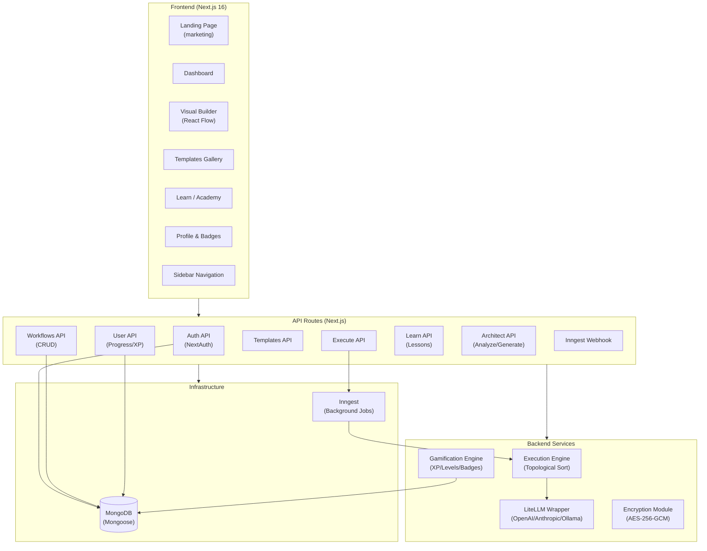

<](#)
[](#license)
[](https://nextjs.org/)
[](#ai-integration-layer)
[](https://www.mongodb.com/)
[](https://www.inngest.com/)

> **Learn AI by building it visually.** Create agents, workflows, and AI tools with drag-and-drop blocks. See prompts, memory, tools, and outputs step by step. No black boxes.

---

## Table of Contents

- [Overview](#-overview)
- [Who Is This For?](#-who-is-this-for)
- [Complete Feature List](#-complete-feature-list)
- [Node Reference Guide](#-node-reference-guide)
- [Building & Running Your First Flow](#-building--running-your-first-flow)
- [Customizing Node Properties](#-customizing-node-properties)
- [System Architecture](#-system-architecture)
- [Architecture Diagram](#-architecture-diagram)
- [Frontend Architecture](#frontend-architecture-detailed)
- [Backend Architecture](#backend-architecture-detailed)
- [AI Integration Layer](#ai-integration-layer)
- [Gamification & Learning System](#-gamification--learning-system)
- [Self-Hosting Guide](#-self-hosting-guide)
- [API Reference](#-api-reference)
- [Current AI Systems & Future Roadmap](#-current-ai-systems--future-roadmap)
- [Contributing](#-contributing)
- [License](#-license)

---

## 🚀 Overview

BuildRAX.ai is an **open-source visual AI workflow builder** designed to demystify how AI agents, LLM chains, and automated pipelines actually work. Instead of writing complex code to orchestrate prompts, tools, and memory, you connect visual blocks on a canvas and watch data flow through each step in real time.

The platform serves a dual purpose:
1. **A productivity tool** for developers who want to rapidly prototype and deploy AI workflows.
2. **A learning platform** for students, educators, and AI practitioners who want to understand what happens "under the hood" of AI systems.

Every prompt sent to an LLM, every piece of context retrieved from memory, and every tool invocation is fully visible and inspectable through the **Execution Trace Panel**.

---

## 👥 Who Is This For?

### For Non-Technical Users
- **No coding required.** Drag nodes onto a canvas, connect them with edges, and click "Run Flow."
- **Guided learning.** The built-in **BuildRAX Academy** walks you through missions from "What is a Prompt?" to "Multi-Agent Workflows."
- **Templates.** Start from pre-built workflows like "Resume Analyzer" or "Daily Planner" and customize them.

### For Developers
- **Rapid prototyping.** Visually compose LLM chains, tool integrations, and conditional logic before writing production code.
- **Full API backend.** Every workflow has a corresponding REST API with 20+ endpoints for CRUD, execution, and template management.
- **Self-hostable.** Run the entire stack on your own infrastructure with Docker or a bare-metal Node.js setup.

### For AI Practitioners & Researchers
- **Transparent execution.** Inspect the exact system prompt, user message, retrieved context, and raw model output for every run.
- **Model-agnostic.** Switch between OpenAI GPT-4o, Anthropic Claude, or local Ollama models with a single dropdown change.
- **Extensible node system.** Add custom node types for your specific research tools or data sources.

### For Educators
- **Classroom-ready.** The gamified mission system (XP, levels, badges) makes it ideal for AI courses and workshops.
- **Visual explanations.** Students can literally see how RAG, tool-use, and multi-step reasoning work.

---

## ✨ Complete Feature List

### Visual Workflow Builder
| Feature | Description |
|---------|-------------|
| **Drag & Drop Canvas** | Built on React Flow (`@xyflow/react`) with smooth panning, zooming, and snapping. |
| **14 Node Types** | Input, Output, Prompt, LLM, Memory, Search, Scraper, Slack, Discord, Twitter, Email, Condition, Loop, Combine. |
| **Live Connection Handles** | Animated edges show data flow direction between connected nodes. |
| **Properties Panel** | Right-side panel for editing node-specific settings (model, temperature, prompt template, etc.). |
| **Node Library Sidebar** | Categorized, searchable sidebar with descriptions for each node type. |
| **Mini Map** | Bird's-eye view of the entire workflow graph for easy navigation. |
| **Canvas Controls** | Zoom in/out, fit view, and interactive mode toggles. |

### Execution & Debugging
| Feature | Description |
|---------|-------------|
| **Execution Trace Panel** | Step-by-step timeline showing what happened at each node with timing data. |
| **Prompt Inspector** | View the exact system prompt + user message sent to the model. |
| **Context Tab** | See retrieved documents and tool outputs used as context. |
| **Output Tab** | Rendered final output with generation time and token usage. |
| **Background Execution** | Long-running workflows execute reliably via Inngest with automatic retries. |
| **Simulated Outputs** | Nodes show real-time "Simulated Output" previews during execution. |

### Templates & Sharing
| Feature | Description |
|---------|-------------|
| **Starter Templates** | 5 pre-built templates: Resume Analyzer, Research Synthesizer, Daily Planner, Content Generator, Simple Research Agent. |
| **Template Gallery** | Searchable, categorized gallery with difficulty levels and estimated build times. |
| **Clone to Builder** | One-click cloning of any template directly into your builder canvas. |
| **Publish & Share** | Publish workflows as public templates or share via private link. |
| **Remixing** | Toggle to allow/disallow community remixing of your published workflows. |

### Authentication & User Management
| Feature | Description |
|---------|-------------|
| **Multi-Provider Auth** | GitHub OAuth, Google OAuth, and Guest mode via NextAuth.js. |
| **JWT Sessions** | Stateless session management with JWT strategy. |
| **Encrypted API Keys** | User API keys stored with AES-256-GCM encryption. |
| **Profile Page** | View total XP, workflow count, templates cloned, and current streak. |

### Gamification
| Feature | Description |
|---------|-------------|
| **XP System** | Earn XP for executing workflows (50), completing lessons (100), creating workflows (25), and publishing templates (200). |
| **Level Progression** | 500 XP per level with linear progression. |
| **Badge System** | Unlockable badges: First Build, Community Builder, Prompt Tuner, Agent Explorer. |
| **Progress Tracking** | Real-time XP bar in the sidebar, dashboard, and profile page. |

### Learning (BuildRAX Academy)
| Feature | Description |
|---------|-------------|
| **5 Interactive Missions** | From "What is a Prompt?" to "Multi-Agent Workflows." |
| **Progressive Difficulty** | Beginner → Intermediate → Advanced with locked gates. |
| **XP Rewards per Mission** | 30, 50, 75, 100, 200 XP respectively. |
| **Onboarding Tutorial** | First-time user guided walkthrough of the platform. |

### Dashboard
| Feature | Description |
|---------|-------------|
| **Welcome Banner** | Personalized greeting with level, XP progress, and next badge target. |
| **Recent Workflows** | Quick access to your latest projects with status and timestamps. |
| **Suggested Templates** | Curated starter templates based on your level. |

---

## 🧩 Node Reference Guide

BuildRAX ships with **14 node types**, each designed for a specific role in an AI pipeline:

### Core Nodes

#### 🔵 Input Node
- **Purpose**: The entry point of any workflow. Defines the initial data that flows through the pipeline.
- **Inputs**: None (this is the first node).
- **Outputs**: `default` — the raw input value.
- **Properties**: A text area where you type or paste the initial data (e.g., a question, a resume, a URL).
- **Example Use**: "Analyze this resume for a Senior Frontend Developer role."

#### 🟠 Prompt Node
- **Purpose**: Constructs a formatted prompt string using a template and injected variables.
- **Inputs**: `input` — receives data from upstream nodes.
- **Outputs**: `prompt` — the assembled prompt string.
- **Properties**: A template text area supporting `{{handle}}` syntax for variable injection.
- **Example Template**: `"Analyze this resume against the target job. {{default}}"`

#### 🟣 LLM Node
- **Purpose**: Sends the assembled prompt to a language model and returns the generated response.
- **Inputs**: `prompt` — the formatted prompt string.
- **Outputs**: `default` — the raw model response.
- **Properties**:
  - **Model**: Dropdown to select `GPT-3.5 Turbo`, `GPT-4o`, or `Llama 3 (Ollama)`.
  - **System Prompt**: A text area for the model's system-level instructions.
  - **Temperature**: Slider from 0 to 2 (default 0.7). Lower = more deterministic, higher = more creative.

#### 🟢 Output Node
- **Purpose**: The final destination of the workflow. Displays the last result.
- **Inputs**: `default` — the final data to display.
- **Outputs**: None (this is the terminal node).

### Tool & Integration Nodes

#### 🔍 Search Node (Google Search)
- **Purpose**: Performs a web search query and returns results. Useful for grounding LLM responses in real-time data.
- **Inputs**: `query` — the search query string.
- **Outputs**: `results` — structured search results.

#### 🌐 Scraper Node (Web Scraper)
- **Purpose**: Fetches and extracts content from a given URL.
- **Inputs**: `url` — the target URL to scrape.
- **Outputs**: `content` — the extracted page content.

#### 🟦 Memory Node (Vector DB)
- **Purpose**: Performs a similarity search against a vector database to retrieve relevant context for RAG workflows.
- **Inputs**: `query` — the search query for the vector store.
- **Outputs**: `context` — the retrieved documents/chunks.

### Communication Nodes

#### 💬 Slack Node
- **Purpose**: Sends a message to a configured Slack channel.
- **Inputs**: `message` — the content to send.

#### 💬 Discord Node
- **Purpose**: Sends a message to a configured Discord channel.
- **Inputs**: `message` — the content to send.

#### 🐦 Twitter Node
- **Purpose**: Posts content to Twitter/X.
- **Inputs**: `content` — the tweet content.

#### ✉️ Email Node
- **Purpose**: Sends an email with the provided body content.
- **Inputs**: `body` — the email body text.

### Control Flow Nodes

#### 🟡 Condition Node
- **Purpose**: Splits the flow based on a boolean evaluation. Acts as an If/Else gate.
- **Inputs**: `input` — the data to evaluate.
- **Outputs**: `true` (if condition passes) and `false` (if condition fails).

#### 🩷 Loop Node
- **Purpose**: Iterates over an array, processing each item through connected downstream nodes.
- **Inputs**: `array` — the collection to iterate over.
- **Outputs**: `item` — the current item in each iteration.

#### 🩵 Combine Node
- **Purpose**: Merges two or more data streams into a single output.
- **Inputs**: `a` and `b` — two data streams to merge.
- **Outputs**: `merged` — the combined result.

---

## 🔄 Building & Running Your First Flow

### Step 1: Open the Builder
Navigate to `/builder` from the dashboard or sidebar. You'll see an empty canvas with three default nodes (Input → LLM → Output).

### Step 2: Add Nodes from the Library
The **Node Library** panel on the left shows all available node types. To add a node:
1. Find the node you want (e.g., "Prompt").
2. **Drag** it from the sidebar onto the canvas.
3. It will appear at the drop position with default settings.

### Step 3: Connect Nodes with Edges
1. Hover over the **right handle** (output) of any node — a small circular connector appears.
2. Click and drag from the output handle to the **left handle** (input) of the target node.
3. An animated edge forms, showing the direction of data flow.

### Step 4: Configure Node Properties
Click on any node to select it. The **Properties Panel** on the right will update to show editable fields specific to that node type (see [Customizing Node Properties](#-customizing-node-properties)).

### Step 5: Run the Flow
Click the **"▶ Run Flow"** button in the top-right toolbar. This:
1. Validates the graph is a valid DAG (no cycles).
2. Topologically sorts nodes using **Kahn's algorithm**.
3. Executes each node in order, passing outputs to downstream inputs.
4. Opens the **Execution Trace Panel** showing real-time step-by-step results.

### Step 6: Inspect the Execution
The Execution Trace Panel has 4 tabs:
- **Flow Steps**: Timeline of every node execution with timing data.
- **Prompt**: The exact system prompt and user message sent to the LLM.
- **Context**: Any retrieved documents or tool outputs.
- **Output**: The final rendered response with generation metadata.

---

## ⚙ Customizing Node Properties

When you select any node on the canvas, the **Properties Panel** on the right updates with editable fields.

### Input Node Properties
| Property | Type | Description |
|----------|------|-------------|
| Input Value | `textarea` | The raw data to inject into the workflow. |

### Prompt Node Properties
| Property | Type | Description |
|----------|------|-------------|
| Template String | `textarea` | Prompt template with `{{handle}}` variable placeholders. |

### LLM Node Properties
| Property | Type | Description |
|----------|------|-------------|
| Model | `dropdown` | Select from GPT-3.5 Turbo, GPT-4o, Llama 3 (Ollama). |
| System Prompt | `textarea` | Instructions for the model's behavior and persona. |
| Temperature | `slider` (0–2) | Controls randomness. 0 = deterministic, 2 = highly creative. |

### All Nodes (BaseNode)
Every node inherits from a common `BaseNode` component that provides:
- Color-coded headers based on node category.
- Input/output handles positioned dynamically.
- **Simulated Output** preview box that shows processing state and results during execution.
- Selection highlighting (ring + scale animation).

---

## 🏗 System Architecture

### Architecture Diagram



### Frontend Architecture (Detailed)

| Technology | Version | Purpose |
|------------|---------|---------|
| **Next.js** | 16.2.1 | App Router framework with Route Groups (`(marketing)`, `(app)`) |
| **React** | 19.2.4 | UI rendering |
| **@xyflow/react** | 12.10.1 | Visual workflow canvas (React Flow) |
| **Framer Motion** | 12.38.0 | Page transitions and micro-animations |
| **Tailwind CSS** | v4 | Utility-first styling with dark mode |
| **shadcn/ui** | 4.1.0 | Pre-built accessible components (Dialog, Sheet, Tabs, etc.) |
| **Lucide React** | 0.577.0 | Icon library |
| **Geist & Geist Mono** | — | Typography (via `next/font`) |

#### Route Structure
```
src/app/
├── (marketing)/          # Public landing page & login
│   ├── page.tsx          # Landing page with hero, features, OSS banner
│   └── login/page.tsx    # Authentication page
├── (app)/                # Authenticated app shell with sidebar
│   ├── layout.tsx        # App shell layout with persistent sidebar
│   ├── dashboard/        # Personalized dashboard with XP and workflows
│   ├── builder/          # Visual AI workflow builder (React Flow canvas)
│   ├── templates/        # Template gallery with search and categories
│   ├── learn/            # BuildRAX Academy with missions
│   └── profile/          # User profile, badges, and detailed stats
├── api/                  # 20+ REST API routes
└── layout.tsx            # Root layout (dark mode, providers, fonts)
```

### Backend Architecture (Detailed)

#### Authentication
- **NextAuth.js** with JWT session strategy and MongoDB adapter.
- **3 auth providers**: GitHub OAuth, Google OAuth, Guest mode (no credentials required).
- API keys stored encrypted using AES-256-GCM via `crypto` native module.

#### Database (MongoDB + Mongoose)
4 core models:

| Model | Key Fields | Purpose |
|-------|------------|---------|
| **User** | `name`, `email`, `xp`, `level`, `badges`, `encryptedApiKeys` | User identity, progress, and secure key storage |
| **Workflow** | `name`, `nodes`, `edges`, `viewport`, `creatorId`, `isPublic`, `xpValue`, `clones` | Graph structure and metadata |
| **Execution** | `workflowId`, `userId`, `status`, `results[]`, `startedAt`, `completedAt` | Per-node execution logs with timing and errors |
| **Template** | `name`, `description`, `category`, `nodes`, `edges` | Community and starter templates |
| **LessonProgress** | `userId`, `lessonId`, `status`, `completedAt` | Learning path tracking |

#### Execution Pipeline
1. **Client** clicks "Run Flow" → POST to `/api/execute`.
2. API creates an `Execution` record in MongoDB with status `running`.
3. API sends a `workflow.execute` event to **Inngest**.
4. Inngest picks up the event and runs `executeWorkflowBackground`:
   - Connects to MongoDB.
   - Creates an `ExecutionEngine` instance with the graph's nodes and edges.
   - Calls `getExecutionOrder()` → Kahn's algorithm produces a topological sort.
   - Iterates through nodes in order:
     - `inputNode` → returns raw `data.value`.
     - `promptNode` → replaces `{{handle}}` placeholders with upstream outputs.
     - `llmNode` → calls `generateText()` via LiteLLM wrapper.
     - `outputNode` → passes through the final result.
   - Records per-node `output`, `executionTimeMs`, and `error` (if any).
5. Updates the `Execution` record with `status: completed|failed` and the full results array.

### AI Integration Layer

BuildRAX uses a **unified LiteLLM wrapper** (`src/lib/litellm.ts`) that routes all LLM calls through a single interface:

```
┌─────────────────────────────────────────────────────────┐
│                    LiteLLM Wrapper                       │
├─────────────────────────────────────────────────────────┤
│  ENV: LITELLM_BASE_URL → Custom proxy (LiteLLM/Ollama) │
│  ENV: OPENAI_API_KEY   → Direct OpenAI fallback         │
│  ENV: LITELLM_API_KEY  → Proxy authentication           │
├─────────────────────────────────────────────────────────┤
│  Supported Models:                                      │
│  • gpt-3.5-turbo (OpenAI)                              │
│  • gpt-4o (OpenAI)                                     │
│  • llama3 (via Ollama)                                 │
│  • Any model supported by LiteLLM proxy                 │
├─────────────────────────────────────────────────────────┤
│  API: generateText(prompt, systemPrompt, options)       │
│  Options: { model, temperature, max_tokens }            │
└─────────────────────────────────────────────────────────┘
```

**How it works**: If `LITELLM_BASE_URL` is set, all requests route through that proxy (supporting 100+ models via LiteLLM). Otherwise, it falls back to direct OpenAI API calls.

---

## 🎮 Gamification & Learning System

### XP Rewards
| Action | XP Earned |
|--------|-----------|
| Execute a workflow | +50 XP |
| Complete a lesson | +100 XP |
| Create a new workflow | +25 XP |
| Publish a template | +200 XP |

### Leveling System
- **500 XP per level** (linear progression).
- Level displayed in sidebar, dashboard banner, and profile.
- Badge targets evolve: **Workflow Creator** (Lvl 5) → **Logic Master** (Lvl 10) → **AI Architect** (Lvl 15+).

### Badges
| Badge | Requirement |
|-------|-------------|
| **First Build** | Complete your first AI workflow execution. |
| **Community Builder** | Publish a workflow that gets 10+ clones. |
| **Prompt Tuner** | Edit a prompt node and successfully reduce latency. |
| **Agent Explorer** | Use memory and tools in the same workflow. |

### BuildRAX Academy Missions
| # | Mission | Difficulty | Time | XP |
|---|---------|-----------|------|-----|
| 1 | What is a Prompt? | Beginner | 2 min | 30 |
| 2 | Exploring LLM Settings | Beginner | 5 min | 50 |
| 3 | Adding Memory | Intermediate | 10 min | 75 |
| 4 | Using External Tools | Intermediate | 15 min | 100 |
| 5 | Multi-Agent Workflows | Advanced | 20 min | 200 |

---

## 🖥 Self-Hosting Guide

### Prerequisites
- **Node.js** 18+ (recommended: 20 LTS)
- **MongoDB** 6+ (Atlas cloud or local instance)
- **npm** or **pnpm**

### Option 1: Bare Metal / VPS

```bash
# 1. Clone the repository
git clone https://github.com/chetanya1998/BuildRAX.ai.git
cd BuildRAX.ai

# 2. Install dependencies
npm install

# 3. Configure environment variables
cp .env.example .env.local
```

Edit `.env.local` with your values:
```env
# Required
MONGODB_URI=mongodb+srv://<user>:<pass>@cluster.mongodb.net/buildrax
NEXTAUTH_SECRET=<your-random-secret-string>
NEXTAUTH_URL=http://localhost:3000

# AI Provider (at least one required)
OPENAI_API_KEY=sk-...

# Optional: LiteLLM Proxy (for 100+ model support)
LITELLM_BASE_URL=http://localhost:4000
LITELLM_API_KEY=sk-...

# Optional: OAuth Providers
GITHUB_ID=<your-github-oauth-app-id>
GITHUB_SECRET=<your-github-oauth-app-secret>
GOOGLE_ID=<your-google-oauth-client-id>
GOOGLE_SECRET=<your-google-oauth-client-secret>

# Optional: Security
ENCRYPTION_SECRET=<32-character-string-for-api-key-encryption>
```

```bash
# 4. Start the development server
npm run dev

# 5. In a separate terminal, start Inngest Dev Server
npx inngest-cli@latest dev
```

The app will be available at `http://localhost:3000`.

### Option 2: Production Build

```bash
# Build the production bundle
npm run build

# Start the production server
npm start
```

### Option 3: Using LiteLLM Proxy (for local/self-hosted models)

If you want to use **Ollama** or other self-hosted models:

```bash
# 1. Install and start Ollama
ollama serve
ollama pull llama3

# 2. Install LiteLLM proxy
pip install litellm[proxy]

# 3. Start LiteLLM proxy
litellm --model ollama/llama3 --port 4000

# 4. Set LITELLM_BASE_URL in .env.local
LITELLM_BASE_URL=http://localhost:4000
```

Now all LLM nodes in BuildRAX will route through your local Ollama instance — **no cloud API keys required**.

### Customization Points
- **Add new node types**: Create a component in `src/components/nodes/`, register it in the `nodeTypes` map in `src/components/nodes/index.tsx`.
- **Add new API routes**: Create a `route.ts` file under `src/app/api/`.
- **Modify the theme**: Edit `src/app/globals.css` (Tailwind CSS v4 config with CSS variables).
- **Add auth providers**: Add providers in `src/lib/auth.ts`.

---

## 📡 API Reference

BuildRAX exposes **20 REST API routes** under `/api/`:

### Authentication
| Method | Endpoint | Description |
|--------|----------|-------------|
| * | `/api/auth/[...nextauth]` | NextAuth.js handler (login, callback, session) |

### Workflows
| Method | Endpoint | Description |
|--------|----------|-------------|
| GET/POST | `/api/workflows` | List all or create a new workflow |
| GET/PUT/DELETE | `/api/workflows/[id]` | Get, update, or delete a specific workflow |
| GET | `/api/workflows/recent` | Get recently edited workflows |
| POST | `/api/workflows/[id]/quick-run` | Quick-run a workflow inline |

### Execution
| Method | Endpoint | Description |
|--------|----------|-------------|
| POST | `/api/execute` | Start a background workflow execution via Inngest |
| GET | `/api/execute/stream` | Stream execution results in real-time |

### Templates
| Method | Endpoint | Description |
|--------|----------|-------------|
| GET/POST | `/api/templates` | List or create templates |
| GET | `/api/templates/featured` | Get featured/starter templates |
| GET | `/api/templates/[id]` | Get a specific template |
| POST | `/api/templates/[id]/clone` | Clone a template into user's workflows |

### User
| Method | Endpoint | Description |
|--------|----------|-------------|
| GET | `/api/user/progress` | Get user's XP, level, and progress |
| POST | `/api/user/xp/gain` | Award XP to the current user |

### Learning
| Method | Endpoint | Description |
|--------|----------|-------------|
| GET | `/api/learn/status` | Get lesson completion status |
| POST | `/api/learn/complete` | Mark a lesson as completed |
| POST | `/api/learn/complete-step` | Mark an individual step as done |

### Dashboard & AI
| Method | Endpoint | Description |
|--------|----------|-------------|
| GET | `/api/dashboard/summary` | Aggregated dashboard data |
| POST | `/api/architect/analyze` | AI-powered workflow analysis |
| POST | `/api/architect/generate` | AI-powered workflow generation |

### Inngest
| Method | Endpoint | Description |
|--------|----------|-------------|
| * | `/api/inngest` | Inngest webhook handler |

---

## 🗺 Current AI Systems & Future Roadmap

### ✅ Current AI Capabilities
- **Multi-model LLM support** via LiteLLM (OpenAI, Anthropic, Ollama, and 100+ providers).
- **Dynamic prompt engineering** with template variable injection.
- **Basic memory/vector store** integration for RAG workflows.
- **Topological execution engine** with cycle detection and dependency resolution.
- **AI Architect** endpoints for automated workflow analysis and generation.
- **Background execution** with Inngest for reliable, fault-tolerant processing.
- **Encrypted API key storage** for secure multi-provider access.

### 🏗 In Development
- **Python Execution Nodes** — Run arbitrary Python code blocks within the visual flow for data processing, ML inference, and scripting.
- **Multi-Agent Orchestration** — Native support for agent-to-agent communication, enabling supervisor-worker patterns and collaborative reasoning.
- **Advanced RAG Pipeline** — Built-in vector embedding, document chunking, and similarity search management without external tools.
- **Agent-as-an-API** — One-click deployment of visual workflows as standard REST API endpoints, turning any workflow into a production service.

### 🔮 Future Vision
- **Real-time collaboration** — Multiple users editing the same workflow simultaneously.
- **Version control** — Git-like branching and history for workflows.
- **Marketplace** — Community marketplace for premium templates and custom node packages.
- **Mobile companion** — Monitor and trigger workflows from a mobile app.
- **Enterprise features** — Team workspaces, audit logs, SSO, and role-based access control.

---

## 🤝 Contributing

We welcome contributions from developers of all skill levels!

### Ways to Contribute
- **🧩 New Node Types**: Add nodes for specific APIs, databases, or custom logic. Create a component in `src/components/nodes/` and register it in the `nodeTypes` map.
- **📄 Templates**: Design and share useful workflow templates for the community gallery.
- **⚡ Core Engine**: Improve the execution engine's speed, reliability, or add new control flow primitives.
- **📚 Documentation**: Help expand this README, add inline code documentation, or create tutorials.
- **🎨 UI/UX**: Improve the visual design, accessibility, or add new interface features.

### Development Workflow
```bash
# Fork and clone
git clone https://github.com/<your-username>/BuildRAX.ai.git
cd BuildRAX.ai

# Install dependencies
npm install

# Create a feature branch
git checkout -b feature/my-awesome-node

# Start dev server
npm run dev

# Make your changes, then submit a PR
git push origin feature/my-awesome-node
```

### Code Structure at a Glance
```
src/
├── app/                  # Next.js pages and API routes
│   ├── (marketing)/      # Public-facing pages
│   ├── (app)/            # Authenticated application pages
│   └── api/              # 20+ REST API endpoints
├── components/           # React components
│   ├── nodes/            # Custom React Flow node types
│   │   ├── BaseNode.tsx  # Shared node component
│   │   └── index.tsx     # All 14 node type definitions
│   ├── Sidebar.tsx       # App navigation sidebar
│   ├── ExecutionPanel.tsx # Execution trace viewer
│   └── PublishModal.tsx  # Workflow sharing dialog
├── inngest/              # Background job definitions
│   ├── client.ts         # Inngest client setup
│   └── functions.ts      # Workflow execution function
└── lib/                  # Core utilities and services
    ├── auth.ts           # NextAuth configuration
    ├── encryption.ts     # AES-256-GCM key encryption
    ├── execution-engine.ts # DAG topological sort engine
    ├── gamification.ts   # XP, levels, and badges logic
    ├── litellm.ts        # Multi-provider AI wrapper
    ├── mongodb.ts        # Mongoose connection
    ├── mongodb-client.ts # Native MongoDB client for NextAuth
    └── models/           # Mongoose schemas
        ├── User.ts
        ├── Workflow.ts
        ├── Execution.ts
        ├── Template.ts
        └── LessonProgress.ts
```

---

## 📜 License

MIT License

Copyright (c) 2025 BuildRAX.ai

Permission is hereby granted, free of charge, to any person obtaining a copy
of this software and associated documentation files (the "Software"), to deal
in the Software without restriction, including without limitation the rights
to use, copy, modify, merge, publish, distribute, sublicense, and/or sell
copies of the Software, and to permit persons to whom the Software is
furnished to do so, subject to the following conditions:

The above copyright notice and this permission notice shall be included in all
copies or substantial portions of the Software.

THE SOFTWARE IS PROVIDED "AS IS", WITHOUT WARRANTY OF ANY KIND, EXPRESS OR
IMPLIED, INCLUDING BUT NOT LIMITED TO THE WARRANTIES OF MERCHANTABILITY,
FITNESS FOR A PARTICULAR PURPOSE AND NONINFRINGEMENT. IN NO EVENT SHALL THE
AUTHORS OR COPYRIGHT HOLDERS BE LIABLE FOR ANY CLAIM, DAMAGES OR OTHER
LIABILITY, WHETHER IN AN ACTION OF CONTRACT, TORT OR OTHERWISE, ARISING FROM,
OUT OF OR IN CONNECTION WITH THE SOFTWARE OR THE USE OR OTHER DEALINGS IN THE
SOFTWARE.

---

<p align="center">
  <strong>BuildRAX.ai</strong> — See how AI works. Build with it visually.<br>
  <a href="https://github.com/chetanya1998/BuildRAX.ai">GitHub</a> • 
  <a href="#-self-hosting-guide">Self-Host</a> • 
  <a href="#-contributing">Contribute</a>
</p>
]]>
