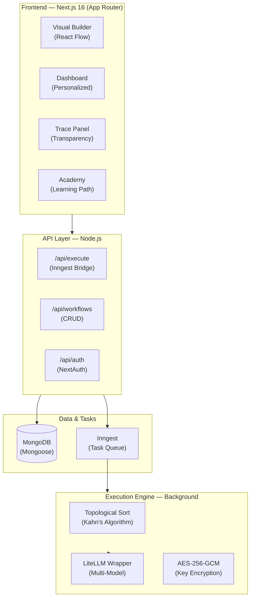

<div align="center">

# 🧠 BuildRAX.ai

**Demystifying AI through Visual Logic.**

Create agents, workflows, and AI tools with drag-and-drop blocks.
See prompts, memory, tools, and outputs step-by-step. No black boxes.

[](#)
[](#-license)
[](https://nextjs.org/)
[](https://www.mongodb.com/)
[](https://www.inngest.com/)

[Quick Start](#-quick-start) · [Explore Features](#-feature-deep-dive) · [Node Reference](#-node-encyclopedia) · [Architecture](#-architecture--under-the-hood) · [Self-Hosting](#-self-hosting-handbook)

</div>

---

## 🧭 Choose Your Path

BuildRAX is designed to serve different audiences by providing transparency into the "AI black box."

### 🎓 I want to Learn (Students & Beginners)
- **Guided Missions**: The BuildRAX Academy walks you from "What is a Prompt?" to "Multi-Agent Workflows."
- **Interactive Traces**: Watch data flow through each node in real-time.
- **Starter Templates**: Clone pre-built flows for Resume Analysis, Research, and Productivity.

### 🛠️ I want to Build (Developers & Architects)
- **Visual DSL**: Orchestrate LLM chains, RAG pipelines, and tool-users without boilerplate.
- **Next.js 16 Backend**: A robust stack with 20+ REST endpoints for CRUD and execution.
- **Rapid Prototyping**: Test prompts and logic cycles in seconds before moving to production.

### 🔬 I want to Analyze (AI Practitioners)
- **Prompt Transparency**: Inspect the exact system prompt and user message for every run.
- **Topological Engine**: Understand dependency resolution and execution order (Kahn's Algorithm).
- **Multi-Model Support**: Swap between OpenAI (GPT-4o), Anthropic (Claude), and local models (Ollama).

---

## ⚡ Quick Start

Get your local instance running in under 5 minutes.

### 1. Clone & Install
```bash
git clone https://github.com/chetanya1998/BuildRAX.ai.git
cd BuildRAX.ai
npm install
```

### 2. Configure Environment
Create a `.env.local` file:
```env
MONGODB_URI=mongodb+srv://<user>:<pass>@cluster.mongodb.net/buildrax
NEXTAUTH_SECRET=your-secret-here
NEXTAUTH_URL=http://localhost:3000

# AI Configuration
OPENAI_API_KEY=sk-...
# Optional: LiteLLM Proxy for local models
LITELLM_BASE_URL=http://localhost:4000
```

### 3. Seed & Start
```bash
# Seed the learning missions
npx tsx seed-missions.ts

# In terminal 1: Start the app
npm run dev

# In terminal 2: Start Inngest (Background Task Runner)
npx inngest-cli@latest dev
```
Navigate to **http://localhost:3000** to begin.

---

## 🎨 Feature Deep Dive

### 🧱 Visual DSL Builder
A low-code canvas built on **React Flow** that turns AI logic into a graph. 
- **Drag-and-Drop**: 14+ specialized node types for input, processing, and integration.
- **Interactive Edges**: Animated data flow shows the direction of state propagation.
- **Mini-Map & Zoom**: Navigate complex multi-agent architectures with ease.
- **UI/UX Enhancements**: High-contrast node blocks, functional gallery filtering, and smooth global page transitions powered by `framer-motion`.

### 🤖 AI Architect
- **Automated Workflow Generation**: The AI Architect generates multi-step workflows automatically based on your prompt, complete with optimal node setup and connections.
- **Analysis Feedback Loops**: Real-time insights and complexity scoring for your workflow graph.
- **Agent Versioning & Benchmarking**: Track the performance and history of your deployed AI agents.

### 🔍 Execution Trace Panel
Every execution generates a detailed "black box" audit trail.
- **Flow Steps**: A timeline of node arrivals, processing times, and departures.
- **Prompt Inspector**: View raw templates vs. final rendered prompts with injected context.
- **Output Preview**: See real-time "Simulated Output" directly on the node headers.

### 🎮 Gamification & Learning
BuildRAX isn't just a tool; it's a game.
- **XP System & Leveling**: Earn 50-200 XP for building, executing, and publishing flows to level up your profile. Special rewards available for first-time publishers!
- **Badges**: Unlock *Prompt Tuner*, *Memory Weaver*, and *Agent Explorer* as you master concepts.
- **Academy**: Interactive, gamified zig-zag pathway for user onboarding and progressive missions with increasing difficulty.

### 🌍 Community & Templates
- **Template Cloning Architecture**: Deep-clone entire workflow graphs (nodes and edges) instantly to your own workspace.
- **Community Publishing**: Publish your agents, accrue ratings from the community, and share your creations.
- **Rich Previews**: Data-rich template modals displaying complexity scores, node sequences, and comprehensive stats.

---

## 🧩 Node Encyclopedia

BuildRAX nodes are powered by a unified `BaseNode` system, ensuring consistent behavior across categories.

### 🟢 Input & Output
| Node | Purpose | Details |
|------|---------|---------|
| **Input** | Gateway | The starting point. Accepts raw text/data to inject into the flow. |
| **Output** | Terminal | Displays the final result of the logic chain. |

### 🧠 Logic & Processing
| Node | Category | Customization |
|------|----------|---------------|
| **Prompt** | Formatting | Support for `{{handle}}` syntax to inject upstream data into templates. |
| **LLM** | Intelligence | Configurable Model (GPT-4o, Llama 3), System Prompt, and Temperature (0.0-2.0). |
| **Memory** | RAG | Similarity search against vector stores to retrieve context for LLMs. |
| **Combine** | Merging | Joins two data streams into a single merged output. |

### 🛠️ Tools & Integrations
| Node | Integration | Functionality |
|------|-------------|---------------|
| **Google Search** | ToolING | Performs live web searches to ground AI answers in real-time data. |
| **Web Scraper** | ToolING | Extracts content from URLs for analysis by LLM nodes. |
| **Slack/Discord** | Messaging | Sends the final output directly to configured channels. |
| **Twitter/Email** | Publishing | Posts updates or sends notifications as part of a workflow. |

### 🔄 Control Flow
| Node | Gate | Logic |
|------|------|-------|
| **Condition** | Branching | If/Else gate based on boolean evaluation. Route to `True` or `False` paths. |
| **Loop** | Iteration | Processes arrays of items through connected downstream logic. |

---

## 🏗️ Architecture & Under the Hood

### System Diagram



### ⚙️ Asynchronous Execution Engine
Powered by **Inngest**, our backend execution engine provides robust, event-driven background processing.
- Handles complex, multi-step AI workflows asynchronously without timing out.
- Reliable state tracking and execution loops for long-running AI and integration operations.

### 🔄 The Topological Sort Engine
Unlike linear scripts, BuildRAX treats flows as **Directed Acyclic Graphs (DAGs)**. When you click run:
1. The engine builds a dependency map of all nodes.
2. **Kahn's Algorithm** verifies there are no cycles and determines the execution order.
3. Steps execute in sequence, passing state from parent outputs to child inputs.

### ⚡ Performance & UX Optimizations
- **Global Navigation Bar**: High-performance routing feedback seamlessly integrated with `nextjs-toploader`.
- **Intelligent Loading states**: Custom AI-themed `FancyLoader` and intelligent skeleton layouts on dashboard and templates eliminate blank screens and greatly enhance perceived performance.

---

## 🖥️ Self-Hosting Handbook

### ⚙️ Prerequisites
- **Node.js**: v20 or higher.
- **MongoDB**: A running instance (local or Atlas).
- **Inngest**: The local dev server is required for workflow execution logic.

### 💾 Database Setup
Before running, you must seed the project with the mission curriculum:
```bash
npx tsx seed-missions.ts
```

### 🤖 Local AI (Ollama)
To run BuildRAX without cloud costs:
1. Install **Ollama**.
2. Run `pip install litellm[proxy]`
3. Start the proxy: `litellm --model ollama/llama3 --port 4000`
4. Set `LITELLM_BASE_URL=http://localhost:4000` in `.env.local`.

---

## 📡 API Reference & Roadmap

| Domain | Key Endpoints |
|--------|---------------|
| **Execution** | `POST /api/execute`, `GET /api/execute/stream` |
| **Planning** | `POST /api/architect/analyze`, `/api/architect/generate` |
| **Community** | `GET /api/templates/featured`, `POST /api/templates/[id]/clone` |

### ✅ Completed
- Visual Builder (14 Node Types)
- Inngest background processing
- Full Academy/XP system
- AES API key encryption

### 🚀 Future
- **Python Nodes**: Run code directly in the flow.
- **Agent Orchestration**: Multi-agent collaborative cycles.
- **Real-time Collab**: Multi-player building.

---

## 📜 License

MIT License - See the file for details.

Copyright (c) 2025 BuildRAX.ai

---

<div align="center">

**BuildRAX.ai** — Building the future of AI transparency.

[GitHub](https://github.com/chetanya1998/BuildRAX.ai) · [Templates](#-choose-your-path) · [Contribute](#-contributing)

</div>
