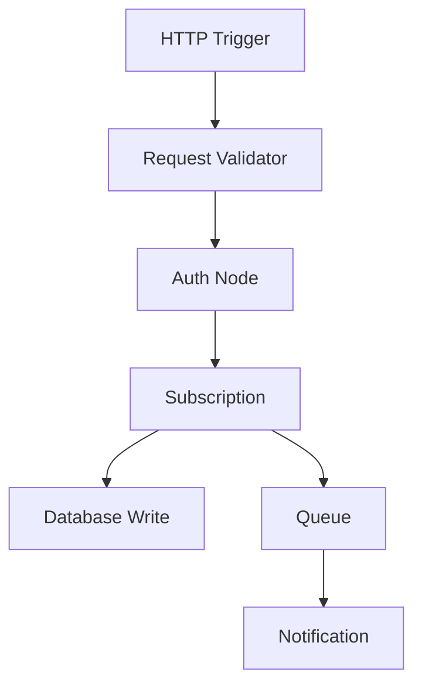

# BuildRAX

BuildRAX is a backend workflow builder and architecture simulator. It helps founders, product teams, engineering teams, consultants, and students design backend systems visually before code is written.

Instead of starting with tickets, scattered diagrams, or a long document, BuildRAX lets a user model the backend as a graph of practical components: API endpoints, authentication, rate limits, databases, queues, workers, third-party integrations, logs, metrics, exports, and custom services. The system can then review the graph, simulate important scenarios, generate Mermaid diagrams, and export developer handoff artifacts.

The current MVP is intentionally deterministic. Review, simulation, Mermaid generation, and export generation do not require AI provider keys, credits, or LLM calls. This makes the product useful even before AI features are added.

## Documentation Map

Start here, then go deeper into the focused references:

- [Node Catalog](./docs/NODES.md): all backend node categories, roles, and examples.
- [Template Catalog](./docs/TEMPLATES.md): the 100 backend blueprint templates and when to use them.
- [Design Patterns](./docs/DESIGN_PATTERNS.md): the architecture and product design patterns used in BuildRAX.
- [AI Roadmap](./docs/AI_ROADMAP.md): how BuildRAX can become AI-enabled while preserving deterministic trust.

## What BuildRAX Solves

Many teams know what product they want but struggle to explain the backend clearly. A typical early conversation sounds like this:

- "We need user login, teams, subscriptions, credits, and reports."
- "What happens if Stripe fails?"
- "Where do we store failed jobs?"
- "Do we need a queue?"
- "How will developers know the API contracts?"
- "Can the founder understand the architecture before engineers start?"

BuildRAX turns those questions into a visual workflow. A non-technical user can see what the system does. A technical user can inspect nodes, dependencies, failure modes, contracts, and export artifacts.

## Who It Is For

### Non-Technical Users

BuildRAX helps non-technical users explain a product idea in backend terms without needing to write code.

Examples:

- A founder planning a SaaS app can start from the "User Authentication SaaS" or "Subscription Billing SaaS" template.
- A product manager can review the happy path and failure path before sending a build request to engineering.
- A consultant can create a client-facing architecture map and export a developer handoff.
- A student can learn why backend systems need auth, rate limits, queues, logs, metrics, and failure handling.

The goal is not to make every user a backend engineer. The goal is to make backend planning visible, reviewable, and easier to discuss.

### Technical Users

BuildRAX helps engineers and architects model backend workflows as structured graphs.

Examples:

- A backend engineer can map API entry points, data stores, queues, and observability before implementation.
- A staff engineer can compare architecture options and spot reliability gaps.
- A technical lead can export workflow JSON, Mermaid diagrams, simulation reports, and developer handoff markdown.
- A platform team can define custom nodes that represent internal systems such as feature flag services, identity services, fraud engines, and internal queues.

The product is designed to be a planning workspace, not a runtime execution engine for production traffic.

## Core Product Flow

The main user journey is:

1. Start from a blank workflow or a template.
2. Add backend nodes to the visual canvas.
3. Configure node details such as role, contracts, outputs, dependencies, and failure modes.
4. Run deterministic review to find design issues.
5. Run simulation to understand behavior under a selected scenario.
6. Generate Mermaid to communicate the architecture.
7. Export developer artifacts for implementation handoff.

This flow is intentionally step-by-step because backend planning works best when users see the system move from idea to design to review to simulation to handoff.

## Complete User Journey Example

Imagine a founder wants to build a SaaS product where companies can invite teammates, pay monthly, and export reports.

### Step 1: Pick a Template

The user opens Templates and chooses "Subscription Billing SaaS" or "Team Collaboration SaaS." BuildRAX loads a workflow with backend components such as:

- HTTP trigger
- request validator
- auth node
- RBAC permission check
- subscription billing
- database write
- notification
- audit log
- metrics

### Step 2: Customize the Workflow

The user opens the builder and adjusts the workflow:

- Adds a rate limiter before public API traffic.
- Adds a queue for async invoice emails.
- Adds a custom node called "Internal Plan Entitlement Service."
- Adds dependencies, outputs, and failure modes for that custom node.

### Step 3: Review

The user clicks Review. BuildRAX opens a review modal and scores areas such as:

- architecture completeness
- security
- reliability
- observability
- operational readiness

If the workflow has no rate limiter, no audit log, or no failure path for payment errors, review flags those issues.

### Step 4: Simulate

The user clicks Simulate. BuildRAX runs a deterministic sandbox trace and produces an overall report:

- status
- trace steps
- fallback gaps
- downstream impact count
- likely bottleneck
- per-node messages

For example, if the payment gateway is the slowest dependency, simulation can show it as a likely bottleneck.

### Step 5: Generate Mermaid

The user clicks Mermaid. BuildRAX generates Mermaid flowchart source. The user can edit it in the Mermaid compiler modal and validate the diagram.

Example Mermaid output:


```mermaid
flowchart TD
    A[HTTP Trigger] --> B[Request Validator]
    B --> C[Auth Node]
    C --> D[Subscription]
    D --> E[Database Write]
    D --> F[Queue]
    F --> G[Notification]
```

### Step 6: Export

The user opens Export and generates:

- Developer Handoff
- Workflow JSON
- Simulation Report

The developer handoff is useful for engineers. The Workflow JSON is useful for persistence, imports, and automation. The simulation report is useful for product and architecture review.

## Main Features

### Visual Backend Builder

The builder uses a graph canvas where each node represents a backend component. Users can add nodes from the node library, connect them, inspect them, and configure their details.

Current builder features:

- collapsible left node library
- collapsible right inspector
- React Flow canvas with minimap and controls
- custom node creation
- node configuration panel
- validation status
- terminal / step compiler panel
- modal-based Review, Simulation, Mermaid, and Export stages

### Custom Nodes

Custom nodes let teams model internal systems or product-specific components that are not part of the default registry.

Custom node fields include:

- name
- role
- behavior description
- dependencies
- outputs
- failure modes

Example:

```text
Name: Fraud Scoring Service
Role: fraud_scoring_service
Dependencies:
- user profile service
- payment history store
- risk rules database

Outputs:
- fraud_score
- risk_level
- review_required

Failure modes:
- provider_timeout
- insufficient_history
- rules_engine_error
```

### Deterministic Review

Review is rule-based. It checks for architecture completeness, security, reliability, scalability, data flow, API design, failure handling, observability, cost awareness, and operational readiness.

Example review finding:

```text
Severity: high
Category: security
Issue: Public API flow has no rate limiter.
Why it matters: A public endpoint without rate limiting is vulnerable to abuse and cost spikes.
Suggested fix: Add a Rate Limiter before the route reaches business logic.
```

### Deterministic Simulation

Simulation walks the graph and estimates behavior for scenarios such as happy path, failure path, timeout, load estimate, and security misuse.

Simulation does not execute real backend code. It is a design-time sandbox that helps teams reason about the workflow.

Example simulation summary:

```text
Scenario: Happy Path
Status: completed
Trace steps: 8
Fallback gaps: 0
Bottleneck: Payment Gateway at approximately 850ms
```

### Mermaid Compiler

The Mermaid stage generates sanitized Mermaid flowchart source and provides an editor/compiler modal. Users can generate, edit, compile, validate, and copy the diagram source.

### Export Center

The Export modal creates practical handoff artifacts:

- Developer Handoff: markdown summary for developers.
- Workflow JSON: portable graph data.
- Simulation Report: scenario, trace, bottleneck, and fallback summary.

Future export types can include OpenAPI specifications, security checklists, architecture decision records, ticket breakdowns, and code scaffolds.

## Existing Node And Template Coverage

BuildRAX currently includes:

- 60 backend node definitions.
- 100 backend blueprint templates.
- 13 node categories.
- 10 template categories.

Detailed references:

- [All Nodes](./docs/NODES.md)
- [All Templates](./docs/TEMPLATES.md)

## Use Cases

### SaaS Product Planning

Plan authentication, workspaces, subscriptions, usage credits, teams, permissions, reports, and exports before implementation.

Example templates:

- User Authentication SaaS
- Multi-Tenant SaaS Workspace
- Subscription Billing SaaS
- Usage-Based Credits SaaS

### Marketplace Architecture

Model users, vendors, listings, escrow, payouts, dispute flows, notifications, audit logs, and admin actions.

Example templates:

- Two-Sided Marketplace
- Freelance Marketplace with Escrow
- Service Booking Marketplace
- Dispute Resolution Marketplace

### AI Product Backend Planning

Design AI product workflows without depending on AI execution during planning. Model prompt builders, LLM calls, vector search, guardrails, output parsers, usage meters, and safety checks.

Example templates:

- AI Chatbot SaaS
- RAG Knowledge Base
- AI Agent Tool Calling
- AI Moderation

### Fintech And Payments

Plan high-risk workflows where correctness, consistency, failure handling, and auditability matter.

Example templates:

- Digital Wallet
- Escrow Payment
- Refund Processing
- Fraud Detection Payment
- Financial Reconciliation

### Internal Tools

Design admin dashboards, approval flows, support operations, incident response, and compliance reporting.

Example templates:

- Admin Dashboard
- Approval Management
- Incident Management
- Compliance Reporting

### Developer Tools

Model API tooling, CI/CD, feature flags, load testing, webhook testing, and multi-environment configuration.

Example templates:

- API Documentation Generator
- CI/CD Pipeline
- Feature Flag System
- Developer API Key Management

## Why This Is Important

Backend architecture is often invisible until something breaks. BuildRAX makes backend planning visible earlier.

This matters because:

- Non-technical stakeholders can understand system behavior before engineering begins.
- Engineers can spot missing auth, missing rate limits, missing observability, and missing failure recovery earlier.
- Teams can align on the shape of the system before writing implementation tickets.
- Mermaid and export artifacts reduce handoff ambiguity.
- Deterministic review and simulation create trust because users can inspect the reasoning instead of relying on vague AI output.

## Technical Stack

Current stack:

- Next.js App Router
- React
- React Flow
- TypeScript
- MongoDB / Mongoose
- NextAuth
- Tailwind-style utility classes
- Mermaid-compatible diagram generation

Important source areas:

- Builder UI: `src/app/(app)/builder/page.tsx`
- Node registry: `src/lib/graph/catalog.ts`
- Generated catalog: `src/lib/data/buildraxCatalog.ts`
- Review engine: `src/lib/backend/review.ts`
- Simulation engine: `src/lib/backend/simulation.ts`
- Mermaid generation: `src/lib/backend/mermaid.ts`
- Export generation: `src/lib/backend/exports.ts`

## Local Development

Install dependencies:

```bash
npm install
```

Create `.env.local`:

```env
MONGODB_URI=mongodb+srv://<user>:<password>@<cluster>/<database>
NEXTAUTH_SECRET=<your-secret>
NEXTAUTH_URL=http://localhost:3001
```

Run the app:

```bash
npm run dev -- --webpack -p 3001
```

Build:

```bash
npm run build
```

Type check:

```bash
npx tsc --noEmit
```

## Roadmap Summary

The near-term roadmap focuses on making the deterministic MVP deeper and more useful:

- stronger graph validation
- scenario-specific simulation controls
- richer Mermaid preview rendering
- OpenAPI export
- security checklist export
- developer ticket export
- template preview diagrams
- workflow version history
- custom node registry persistence
- visual diff between workflow versions

The AI roadmap is deliberately staged so AI augments deterministic behavior instead of replacing it.

See [AI Roadmap](./docs/AI_ROADMAP.md) for the full plan.

## Product Principle

BuildRAX should feel like a premium technical SaaS tool for planning backend systems. It should be dense, fast to scan, dark, focused, and operational. It should avoid vague magic and instead show the user what is happening: nodes, edges, checks, traces, diagrams, exports, and reports.

The long-term vision is an AI-assisted backend architecture workspace where deterministic systems provide the foundation and AI helps generate, explain, improve, compare, and document backend workflows.
