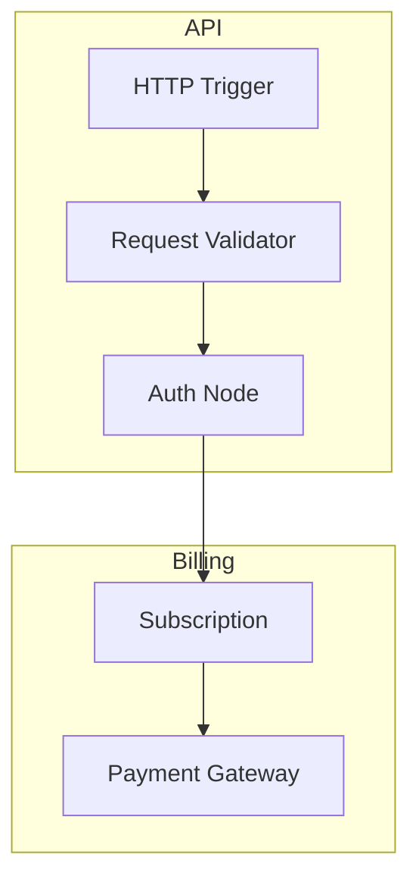

# BuildRAX AI Roadmap

BuildRAX is currently a deterministic backend workflow builder and architecture simulator. The AI roadmap adds intelligence without removing deterministic trust.

The product should not become a black box. AI should help users create, explain, compare, and improve backend workflows while deterministic engines continue to validate, simulate, and export the result.

## AI Design Principle

AI features should follow this rule:

```text
AI may suggest, generate, explain, and improve.
Deterministic systems should validate, simulate, and record.
```

This keeps the product useful for serious technical planning.

## Phase 1: AI-Assisted Workflow Generation

### Feature: Prompt To Workflow

User enters:

```text
I want to build a SaaS app where teams can invite members, manage projects, use monthly credits, and export reports.
```

AI proposes:

- node list
- edges
- assumptions
- missing questions
- recommended template
- suggested review checklist

Example generated workflow:

```text
HTTP Trigger -> Request Validator -> Auth Node -> RBAC Permission Check
RBAC Permission Check -> Service Node -> Database Write
Service Node -> Credit Meter -> Report Export
Report Export -> Queue -> Worker -> Notification
Service Node -> Logger
Service Node -> Metrics
```

Deterministic review then checks the AI-generated graph.

### Feature: Template Recommendation

AI reads the user's product description and suggests existing templates:

- "Subscription Billing SaaS"
- "Usage-Based Credits SaaS"
- "B2B Reporting Dashboard"

It explains why each template is relevant.

## Phase 2: AI Architecture Review Assistant

### Feature: Natural-Language Review Explanation

Deterministic review already produces structured findings. AI can explain them in different styles:

- founder-friendly explanation
- engineer-friendly explanation
- investor/demo explanation
- implementation ticket explanation

Example:

Deterministic finding:

```text
Public API flow has no rate limiter.
```

AI explanation for a founder:

```text
This means anyone could repeatedly call your public endpoint. That can increase cost, slow the app, or create abuse risk. Adding a rate limiter is like putting a controlled gate in front of the system.
```

AI explanation for an engineer:

```text
Place a Rate Limiter before request validation or at the API Gateway layer. Define limits by user ID, IP, API key, or tenant ID depending on the route.
```

### Feature: Suggested Fix Patches

AI can propose graph changes:

- add Rate Limiter before public route
- add Dead Letter Queue after Worker
- add Audit Log after Admin Action
- add Circuit Breaker before Payment Gateway

The user approves before the graph changes.

## Phase 3: AI Simulation Designer

### Feature: Scenario Generation

AI can generate scenario definitions from product context:

- happy path
- unauthorized user
- payment provider timeout
- queue backlog
- database contention
- high-traffic launch day
- suspicious bot traffic
- expired token
- duplicate webhook

The deterministic simulation engine then runs those scenarios.

### Feature: Risk Narrative

AI can turn simulation output into a narrative:

```text
The workflow completes successfully in the happy path, but Payment Gateway is the latency bottleneck. If the payment provider slows down, users may wait longer unless the payment step is moved into an async queue or protected by a circuit breaker.
```

## Phase 4: AI Mermaid And Diagram Assistant

### Feature: Diagram Cleanup

AI can improve diagram readability:

- group nodes by domain
- rename unclear labels
- add subgraphs
- convert a complex graph into multiple diagrams
- generate stakeholder-friendly diagrams

Example:



### Feature: Diagram Explanation

AI can explain a diagram for:

- executives
- product managers
- backend engineers
- security reviewers
- QA teams

## Phase 5: AI Export And Handoff Assistant

### Feature: Developer Tickets

AI can convert a workflow into implementation tickets:

- API routes
- database schema
- background jobs
- integrations
- observability tasks
- security tasks
- test cases

Example ticket:

```text
Title: Add rate limiting for public report export endpoint
Description: Add per-user and per-tenant limits before the report export route reaches the service layer.
Acceptance criteria:
- Requests over the configured limit return 429.
- Metrics emit rate_limited_count.
- Tests cover allowed and blocked requests.
```

### Feature: Architecture Decision Records

AI can generate ADRs:

- why a queue is used
- why a saga is used
- why a payment step is async
- why audit logs are required

### Feature: OpenAPI Draft Generation

AI can draft OpenAPI descriptions from endpoint nodes and contracts.

Deterministic validation should still check formatting and required fields.

## Phase 6: AI Custom Node Builder

### Feature: Custom Node From Description

User enters:

```text
We have an internal entitlement service that checks if a customer can access a premium report.
```

AI proposes:

- name: Entitlement Service
- role: entitlement_guard
- dependencies: subscription database, plan service
- outputs: allowed, denied_reason, plan_level
- failure modes: dependency_timeout, missing_plan, stale_entitlement
- review rules: requires audit logging and fallback behavior

User can accept or edit before adding the node.

## Phase 7: AI Comparison And Optimization

### Feature: Compare Two Architectures

AI can compare:

- sync vs async flow
- single database vs cache-backed flow
- direct provider call vs queue/worker flow
- monolith service node vs event-driven decomposition

Output:

- pros
- cons
- risks
- operational complexity
- recommended option

### Feature: Cost And Latency Suggestions

AI can explain deterministic estimates:

```text
The workflow may become expensive because every request calls the LLM and vector search. Consider caching repeated prompts or using a credit meter before inference.
```

## Phase 8: AI Governance And Safety

### Feature: Policy-Aware Review

AI can evaluate workflow descriptions against team policies:

- payment operations require audit logs
- admin actions require RBAC
- AI outputs require guardrails
- webhook flows require idempotency
- background jobs require DLQ

### Feature: Security Checklist Expansion

AI can generate human-readable security checklists from deterministic findings.

## AI Features That Should Not Be Added Too Early

Avoid these until the deterministic product is strong:

- automatic production code execution
- unreviewed graph mutation
- hidden provider calls
- AI-only review with no structured rules
- AI-only simulation with no deterministic trace
- credit-gated MVP core workflow

## Recommended AI Provider Strategy

BuildRAX can support multiple AI providers through feature flags:

- OpenAI-compatible providers
- hosted model gateways
- local models for private architecture planning
- enterprise provider configuration

AI should be optional. A user should still be able to design, review, simulate, diagram, and export without provider keys.

## Long-Term Vision

The long-term version of BuildRAX becomes an AI-assisted architecture studio:

- AI drafts workflows from product ideas.
- Deterministic review validates the graph.
- AI explains findings in the user's language.
- Deterministic simulation tests the scenarios.
- AI suggests improvements.
- Mermaid and exports produce clean artifacts.
- Developers receive a clear, implementation-ready handoff.

That combination is stronger than AI alone because it gives users speed and trust at the same time.
